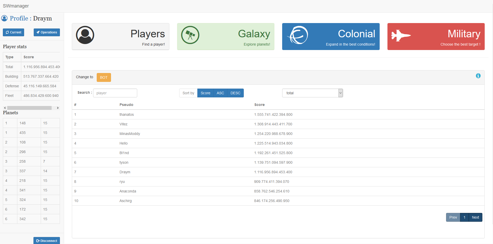
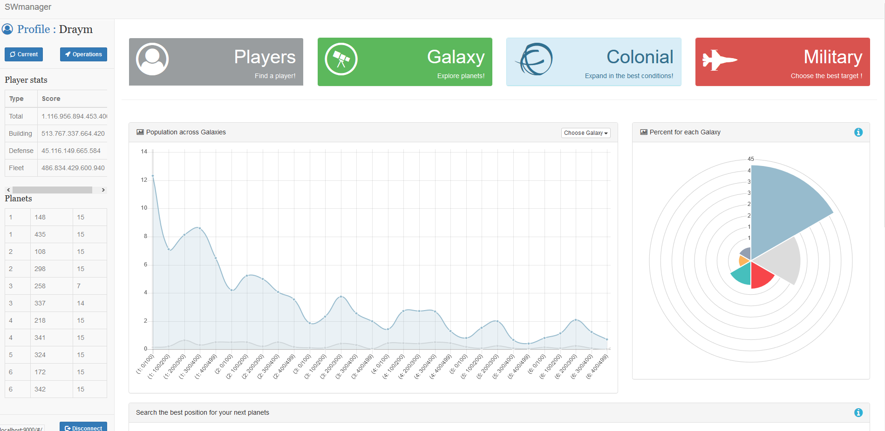
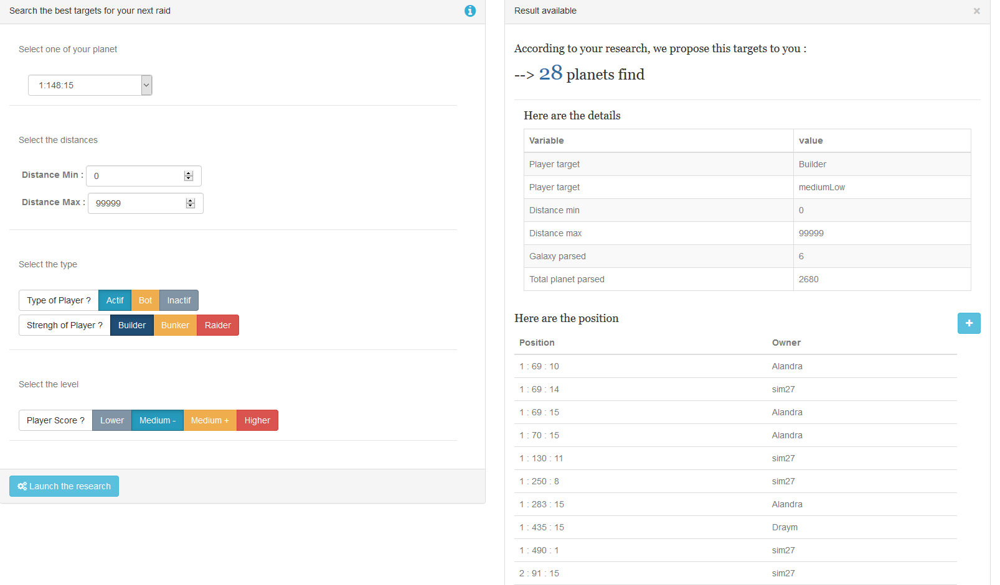
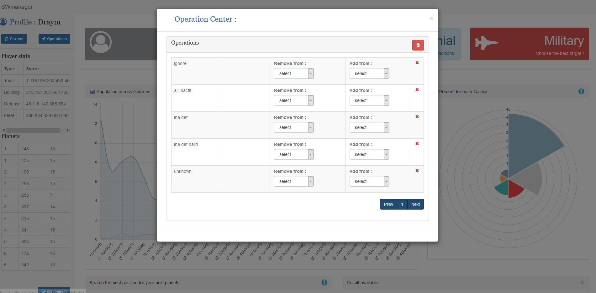
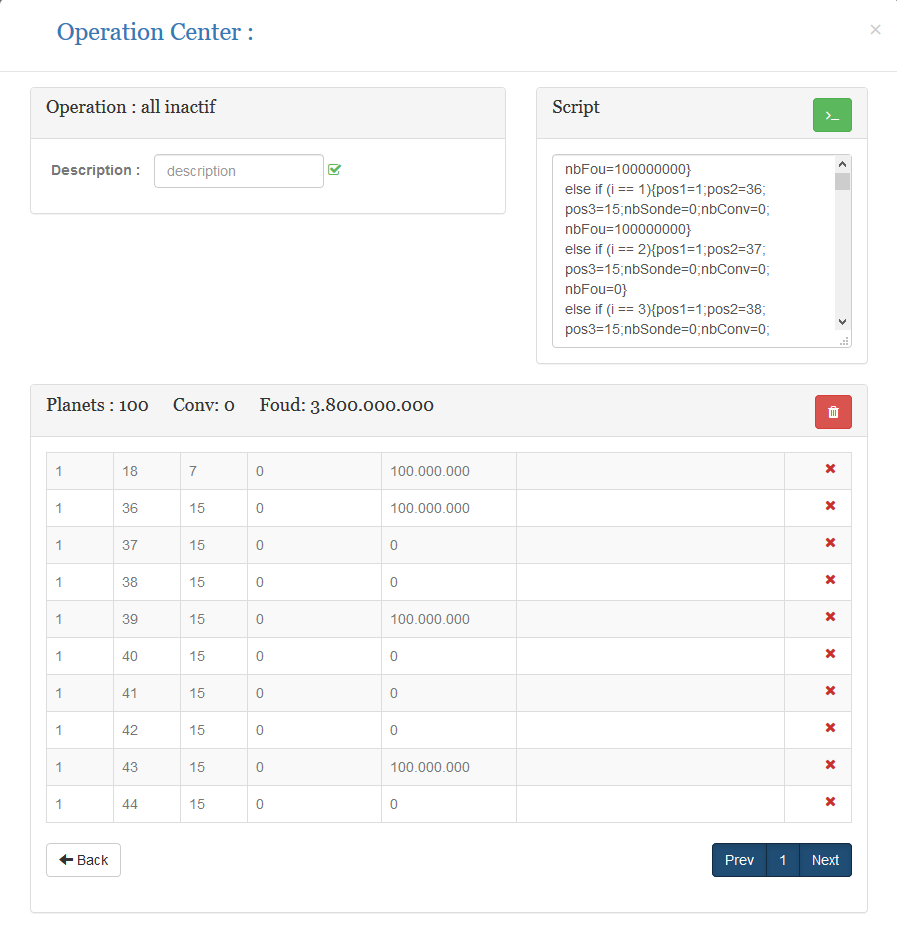

# SWmanager

This a multiple dashboard web-app which help SpacesWars(http://spaceswars.com) players to take future decisions.

-------------------------------------------------------------------------------------------  
## Installation:  

Be sure to have NodeJS installed in your computer for using npm.  

-Front Project  
npm install  
bower install  

-Back Project  
npm install  

Maybe you will have to install grunt and bower :  

npm install grunt  
npm install bower  
npm install bower-cli  
npm install grunt-cli  

-------------------------------------------------------------------------------------------  
## Launch:  

-Front project  
cd SWmanager-front  
grunt serve  

-Back project  
cd SWmanager-back/api  
nodemon bin/www  

-------------------------------------------------------------------------------------------  
## Usage:  

- Player Dashboard : search players and get their details by selecting one

- Colonial Dashboard : data analysis of all the planets actually living per players. It will help you to find the spot you desire in the galaxy

- Military Dashboard : search specific targets by selecting a range of informations

- Operation Centers : create operations and add target to it, it will be saved for your next raids. 

- Scripting : It can offer a prewritten script's action which can be used with **Actionaz** (mp for preconfigured scripts), to automatically launch your raids

